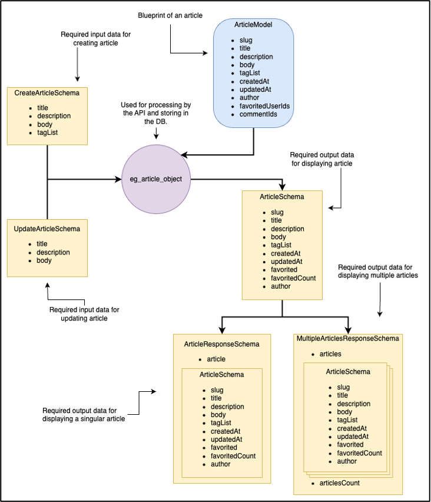
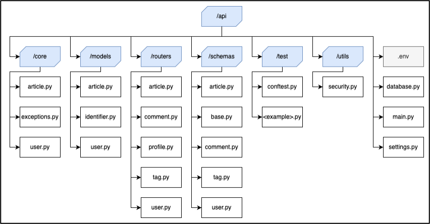
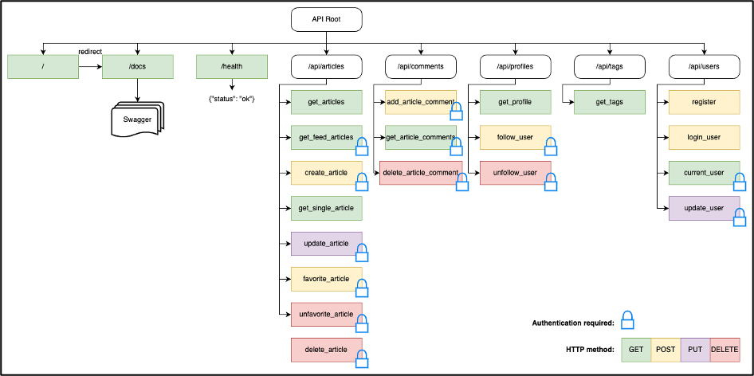
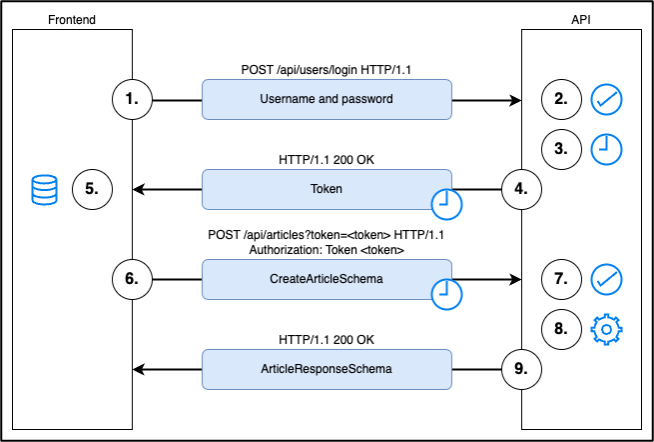
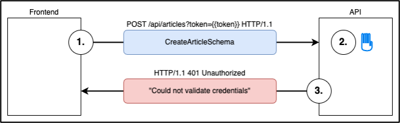

# 

> ### [FastAPI](https://github.com/tiangolo/fastapi) + Couchbase Capella codebase containing real world examples (CRUD, auth, advanced patterns, etc) that adheres to the [RealWorld](https://github.com/gothinkster/realworld) spec and API.


### [Demo](https://demo.realworld.io/)&nbsp;&nbsp;&nbsp;&nbsp;[RealWorld](https://github.com/gothinkster/realworld)


This codebase was created to demonstrate a fully fledged fullstack application built with [FastAPI](https://github.com/tiangolo/fastapi) + Couchbase Capella including CRUD operations, authentication, routing, pagination, and more.

The frontend ([AndyT2503/angular-conduit-signals](https://github.com/AndyT2503/angular-conduit-signals)), developed by another contributor, has been imported as a submodule to illustrate interactions and modularity between the frontend and backend.

For more information on how to this works with other frontends/backends, head over to the [RealWorld](https://github.com/gothinkster/realworld) repository.
---

# Conduit API with FastAPI and Couchbase Capella

## Table of Contents
- [Introduction to RealWorld](#introduction-to-realworld)
- [Introduction to Capella](#introduction-to-capella)
- [Project Outline](#project-outline)
- [Stage 1: Developing Conduit API with FastAPI and Capella](#stage-1)
- [Stage 2: Integrating Frontend for Full-stack Conduit with Cypress E2E Testing Suite](#stage-2)
- [Stage 3: Containerizing Conduit with Docker](#stage-3)
- [Stage 4: Infrastructure Automation with Terraform and Conduit Deployment to AWS](#stage-4)
- [Summary](#summary)

## Introduction to RealWorld
[RealWorld](https://realworld-docs.netlify.app/) is an open-source project that acts as a [Rosetta Stone](https://en.wikipedia.org/wiki/Rosetta_Stone) of web-framework implementations of an app named Conduit (click here for [demo](https://demo.realworld.io/#/)). Conduit is a clone of the blogging platform medium.com and is a simple yet robust web app that includes:
- Querying and persisting data to a database
- An authentication system
- Session management
- Full CRUD for resources
- Relational features like following, liking and commenting.

Conduit is divided into three subprojects: an API, a frontend, and a mobile app. This separation streamlines management and scaling, enabling teams to develop each part independently without overlapping. RealWorld supports this by offering [specs and testing resources](https://realworld-docs.netlify.app/docs/intro), allowing for Test-Driven Development (TDD) to ensure all components meet the required standards.

The modular nature of Conduit allows for easy swapping of [different implementations](https://codebase.show/projects/realworld), regardless of the web framework used, providing developers the flexibility to experiment with various technologies while maintaining functionality.

## Introduction to Capella
[Capella](https://www.couchbase.com/products/capella/) is Couchbase's cloud database-as-a-service (DBaaS) offering. It combines the flexibility and performance of Couchbase’s NoSQL database with the ease of a fully managed cloud service. Capella simplifies database management by automating tasks such as scaling, backups, and maintenance, allowing developers to focus on building and optimizing their applications. With Capella, Conduit benefits from high performance and scalability, supporting its features and operations effortlessly.

## Project Outline
This project was developed over four stages:

### Stage 1: Developing Conduit API with FastAPI and Capella
In Stage 1, a functional REST API for Conduit was developed using the Python web framework [FastAPI](https://fastapi.tiangolo.com/) and Capella. The API was built adhering to TDD principles within a development environment. A Continuous Integration (CI) pipeline was set up using GitHub Actions and run locally with [Act](https://github.com/nektos/act) to test the API against various testing suites, primarily focusing on RealWorld's backend specifications from a [Postman collection](https://github.com/gothinkster/realworld/tree/main/api).

### Stage 2: Integrating Frontend for Full-Stack Conduit with Cypress E2E Testing Suite
Stage 2 involved selecting an existing Conduit frontend from the [open-source codebase](https://codebase.show/projects/realworld) and integrating it with the API in the development environment. This integration resulted in a functional full-stack application. An end-to-end (E2E) testing suite was then built using [Cypress](https://www.cypress.io/) and incorporated into the now expanded CI pipeline.

### Stage 3: Containerizing Conduit with Docker
In Stage 3, the API, frontend, and testing suite were containerized using [Docker](https://www.docker.com/). These containers were then orchestrated within a [Docker Compose](https://www.docker.com/) setup. This smaller stage is in preparation for stage 4.

### Stage 4: Infrastructure Automation with Terraform and Conduit Deployment to AWS
Stage 4 automates infrastructure setup and deployment of the Conduit application to AWS, establishing Staging and Production environments with two new locally-run workflows:
- The Continuous Deployment (CD) pipeline for automatic updates.
- The Teardown (TD) pipeline for efficient resource cleanup.
The Staging environment serves as a deployment testing ground, using the CD pipeline to deploy the application and run CI tests. Once validated, the Production environment follows the same process to deploy the application for end users. The CD pipeline, using [Terraform](https://www.terraform.io/) and [Couchbase Shell](https://couchbase.sh/), provisions necessary AWS and Capella resources. Docker builds, tags, and pushes Conduit images to [Amazon Elastic Container Registry (ECR)](https://aws.amazon.com/ecr/), which [Amazon Elastic Container Service (ECS)](https://aws.amazon.com/ecs/) then pulls to update running containers, keeping deployments current. Finally, the TD pipeline dismantles infrastructure when deployments are ended, deprovisioning AWS and Capella resources efficiently.
---
# Stage 1
## Developing Conduit API with FastAPI and Capella
### Preparation
To prepare for this stage, follow these steps:
1. Clone the codebase to a local repo.
2. Install a version of Python [compatible with the Couchbase Python SDK](https://docs.couchbase.com/python-sdk/current/project-docs/compatibility.html#python-version-compat).
3. Create a new Python virtual environment Refer to resources like the [official Python docs](https://docs.python.org/3/library/venv.html#creating-virtual-environments) for guidance.
4. Install Python dependencies. This can be achieved by running this command:
  ```sh
  ./scripts/local/install-api-deps.sh
  ```
5. Create a remote origin repo in GitHub. This will be for executing the CI workflow.
  - Create a remote repo in GitHub and as the local repo’s origin.
  - In `Environments` under `Settings`, create an environment called `development` and leave all of the configurations as default (repository and environment variables and secrets will be added in coming steps).
6. Set up .env file. There are two `.env.example` files in the project, one in the root directory one in the `/api` directory. The one in the root directory is used by the infrastructure described in Stage 4 (wait until then to implement). The one in the `/api` directory is used by the Conduit API and needs to be implemented in this step. The `.env.example` file is an example layout for a `.env` file, which will contain all of the environment variables. This file will be ignored by the `.gitignore` file and keep the `env` variables local, when the API is run in the CI workflow on GitHub, it will use the environment variables defined there (also implemented in later steps).
  - Change the root directory `.env` file name from `.env.example` to `.env`.
  - Leave the CORS variables as is. The remaining variables will be added in coming steps.
7. Configure JWT settings.
  - Create a random secret key that will be used to sign the JWT tokens. To do this open a terminal and run this command:
    ```sh
    ./scripts/local/generate-secret-key.sh
    ```
  - Copy the resulting string into the remote GitHub repo by setting it as a development environment secret called `JWT_SECRET`.
  - Also copy the resulting string into the local `.env` file by setting it as the environment variable also called `JWT_SECRET`.
8. Create a [Capella account](https://cloud.couchbase.com/sign-up).
  - Couchbase offer a free tier version of Capella. If you want to explore Capella, check out it’s [offical docs](https://docs.couchbase.com/cloud/get-started/intro.html).
9. Create and configure a Capella cluster.
  - Under `Operational`, create a new cluster.
  - Select Free Cluster, give it a name, select your CSP preferences and hit `Create Cluster`.
  - Once the Cluster is deployed, go into it. Under `Data Tools` you will find an example data bucket called `travel-sample`. Delete it.
10.	Create and configure a bucket (This will be automated in stage 4).
  - We’re going to create a new bucket. Hit Create and create a new bucket called `conduit_bucket`. You can leave the Memory Quota at 100 MiB. Select `Use system generated _default for scope and collection`. Capella requires these for a bucket to be linkable to App Services.
  - In the remote repo, set `conduit_bucket` as a repository variable called `DB_BUCKET_NAME`.
  - Also in the local .env file, set `conduit_bucket` as the environment variable also called `DB_BUCKET_NAME`.
11.	Create and configure a scope (This will be automated in stage 4).
  - Using the `Create` button, create a scope, `development`, inside `conduit_bucket` and two collections, `article`, `comment` and `user`*, inside of `development`.\
    *Couchbase has a list keywords that are reserved words. `user` is a reserved keyword, this can be escaped by encasing the name in backticks (`).
  - For indexing, open `Query` under `Data Tools`. Run the following queries in the query box: 
    ```sh
    CREATE PRIMARY INDEX ON `default`:`conduit_bucket`.`development`.`article`;
    CREATE PRIMARY INDEX ON `default`:`conduit_bucket`.`development`.`user`;
    CREATE PRIMARY INDEX ON `default`:`conduit_bucket`.`development`.`comment`;
    ```
  - In the remote repo, set `development` as a development environment variable called `DB_SCOPE_NAME`.
  - Also in the local `.env` file, set `development` as the environment variable also called `DB_SCOPE_NAME`.
12. Configure cluster connection.
  - Open `SDKs` under `Connect`.
  - Copy the public connection string to the remote repo, into a repository var `DB_CONN_STR`.
  - Copy the public connection string and add it as `DB_CONN_STR` in the local `.env` file.
  - Follow the `Allowed IP Addresses` link and add an allowed IP. Select `Allow Access From Anywhere`, this whitelists IP `0.0.0.0/0`*.\
    *(We do this to allow the GitHub runners, which work on varying IPs, to access the cluster when running the CI workflow. In Stage 4, we will run the CD workflow on a local runner, allowing for a more fine-tuned whitelist.)
  - Follow the `Database Access` link and create database access credentials.
  - Copy the Database Access Name and Password to the remote repo. Set the Database Access Name as a repository variable called `DB_USERNAME` and the Password as a repository secret called `DB_PASSWORD`.
  - Also copy the Database Access Name and Password to the local .env file. Set the Database Access Name as the environment variable `DB_USERNAME` and the Password as the environment variable `DB_PASSWORD`.
  - The remaining steps shown aren’t necessary for preparing this stage but are worth exploring.
13.	Double check local and remote environment variables:

    |       Local Repo Configuration      |
    |-------------------------------------|
    | **`.env` file:**<br>`DB_CONN_STR` = &lt;capella connection string&gt;<br>`DB_PASSWORD` = &lt;database access password&gt;<br>`DB_USERNAME` = &lt;database access username&gt;<br>`DB_BUCKET_NAME` = `conduit_bucket`<br>`DB_SCOPE_NAME` = `dev`<br>`JWT_SECRET` = &lt;jwt secret string&gt;<br>`CORS_ALLOWED_ORIGINS` = `http://127.0.0.1`,`http://localhost:4200`<br>`CORS_ALLOWED_METHODS` = `GET`,`POST`,`PUT`,`DELETE`,`OPTIONS`<br>`CORS_ALLOWED_HEADERS` = `Content-Type`,`Authorization` | 

    |      GitHub Repo Configuration      |
    |-------------------------------------|
    | **Repository variables:**<br>`DB_CONN_STR` = &lt;capella connection string&gt;<br>`DB_USERNAME` = &lt;database access username&gt;<br>`DB_BUCKET_NAME` = `conduit_bucket`<br> |
    | **Repository secrets:**<br>`DB_PASSWORD` = &lt;database access password&gt;<br> |
    | **Dev environment variables:**<br>`DB_SCOPE_NAME` = `dev` |
    | **Dev environment secrets:**<br>`JWT_SECRET` = &lt;jwt secret string&gt; |

14. [Optional] Set up Couchbase code editor extension.
  - Download the Couchbase extension in VS Code or IntelliJ IDEA.
  - Log in using details.
  -  This integrates access to the cluster directly from the code editor.
15. Test run.
Run the following command and the API should connect itself to the Capella cluster and start up on `http://127.0.0.1:8000`:
    ```sh
    ./scripts/local/api-run.sh
    ```
    Following the link should lead to a Swagger UI page titled FastAPI & Capella Conduit API (we will discuss this page further in this stage).

### Models and Schemas
Before starting the API, we need to understand how Conduit represents its data as objects. In Conduit, objects are distinct entities within the system, such as Users, Articles, and Comments.

| Object **models** act as blueprints that outline the attributes of these objects. For instance, a model might specify that an object, like a food item, has a flavor. **Schemas** then provide detailed descriptions of these attributes, such as stating that a particular food has a ‘sweet’ flavor. While **models** establish the overall structure of the objects, **schemas** provide the specific details about each attribute. |

A model can **embed** or **refer** to another model as one of its attributes. This establishes a relationship between objects. Conduit has the following examples of this:

**An article object:**
1. Embeds a User object in its `author` attribute.
2. Can refer to multiple User objects in its `favoritedUserIds` attribute.
3. Can refer to multiple Comment objects in its `commentIds` attribute.

**A comment object:**
1. Embeds a User object in its `author` attribute.

**A user object:**
1. Can refer to multiple User objects in its `followingIds`.

These relationships define the object relational structure illustrated in Figure 1:
<div align="center">
  
  <p><em>Figure 1: Object relational structure</em></p>
</div>

Conduit represents object models in JSON form and uses them for processing by the API and storing in the Capella database.

An object’s attributes can be defined or described by a schema. There are typically multiple types of schemas for each object, *each one outlining only the attributes relevant to the specific use case*.

Figure 2 maps the schemas relating to article objects:
<div align="center">
  
  <p><em>Figure 2: Article schemas</em></p>
</div>

Conduit also represents schemas in JSON form and uses them for input (creating and updating) and output (displaying) to and from the API.

### API Start Up

For this stage, we will be primarily using the `/api` directory:

<div align="center">
  
  <p><em>Figure 3: API Directory</em></p>
</div>

When the `start-api.sh` script runs, it launches Uvicorn, a fast ASGI server. Uvicorn then loads the FastAPI application from the `api.main` module, where it is defined as `api`. The FastAPI framework initializes by configuring the Capella database connection, setting up routing, applying middleware and other components defined within the `api` instance, readying the applicating to handle incoming HTTP requests.

### API Database
The Capella database integrates into Conduit via the Capella SDK, enabling interactions with the FastAPI framework. This setup facilitates key-value storage, querying, and schema processing for objects like users, articles, and comments.

**Key Features:**
- Capella SDK: Establishes database connections for inserting, updating, and retrieving JSON-serialized objects, ensuring API-database consistency.
- Key-Value Operations: Each object (e.g., `user:<id>`, `article:<slug>`) is stored with unique keys for low-latency access via get and set methods.
- Querying: Capella's indexing supports advanced queries, such as retrieving comments for an article or users favoriting a specific article.
- Schema Alignment: FastAPI’s Pydantic models define request/response schemas consistent with Capella’s document structure.

**Extensibility:**
Comment Pagination Pagination for comments can improve performance by limiting results per request. Enhancing the `/articles/{slug}/comments` endpoint with parameters like `?page=2&limit=10` would involve:
- Updating Capella queries with offset and limit.
- Adding metadata (e.g., current page, total comments) to the response schema.

### API Endpoints
API routers are accessed via HTTP requests made by clients or other services that interact programmatically with the application. Typically, these endpoints are not directly accessible through a browser because they are designed to handle programmatic requests and are often secured with authentication and authorization mechanisms.

However, FastAPI APIs automatically provides Swagger, an interactive documentation UI, allowing for exploration and testing of the API endpoints. This user-friendly documentation can be accessed via the  `/docs` endpoint, and the root endpoint `/` is configured to redirect to `/docs` automatically.

Note: Swagger UI’s authorization module is not compatible with this project and does not function correctly (refer to the **Security** section for details).

<div align="center">
  
  <p><em>Figure 4: API Endpoints</em></p>
</div>

### Security
RealWorld's security for Conduit relies on the use of JSON Web Tokens (JWTs), which are a secure way to transmit information between two parties through a digitally signed token. In this system, a JWT functions like an access key, granting clients the ability to interact with protected API endpoints. This ensures that only authenticated and authorized clients can access secure areas of the application. The following steps illustrate how JWTs are used for authentication and authorization in this process:

<div align="center">
  
  <p><em>Figure 5: Authorized Request</em></p>
</div>

1. The client POST requests the user’s username and password to the `login_user` endpoint.
2. The API authenticates the client.
3. The API generates an access token (JWT).
4. The API responses with status `200 OK` and the access token.
5. The client stores the access token in local storage.
6. All future client requests include the access token in an `Authorization` header.
7. The API decodes the access token and authenticates the client.
8. The API processes the request (e.g., creating a new article).
9. The API responds with status `200 OK`.

In step 3, the API generates the access token using the `create_access_token` function. The function first defines the token's payload, which includes the user's username and an expiration time set by the `ACCESS_TOKEN_EXPIRE_MINUTES` variable. This payload is then serialized into a JSON string and encoded using the HS256 algorithm, along with a secret key provided by the `SECRET_KEY` environment variable. The resulting encoded JWT is returned as a string, ready to be sent to the client for authentication purposes. The secret key, token expiration and HS256 algorithm are configured in the `settings.py` file.

Another possible scenario is depicted below:

<div align="center">
  
  <p><em>Figure 6: Unauthorized Request</em></p>
</div>

1. The client request does not include an access token in an `Authorization` header.
2. The API does not authorize the client request.
3. The API responds status `401 Unauthorized`.

In Step 7 of Figure 4 and Step 2 of Figure 5, the API manages user authentication depending on whether the endpoint requires authorization. For all endpoints, except for the `register` and `login_user` functions, the API checks for a **current user instance**. If the endpoint requires authorization, it calls the `get_current_user_instance` function (e.g., for creating an article). For unauthorized endpoints, it uses the `get_current_user_optional_instance` function (e.g., for retrieving articles).

These functions use the `OAUTH2_SCHEME` to extract the access token from the request’s Authorization header. They then decode the token using the HS256 algorithm and the secret key, followed by attempting to authenticate the user based on the username contained within the token. If authentication is successful, the user is returned as the **current user instance**, authorizing the client's request to be processed (as in Figure 4). However, if authentication fails, the **current user instance** is returned as `None`. For authorized endpoints, this results in the client’s request being denied and not processed (as shown in Figure 5).

FastAPI provide a variety of OAUTH2 classes in its security module:
```sh
from fastapi.security import (
  OAuth2,
  OAuth2AuthorizationCodeBearer,
  OAuth2PasswordBearer,
  OAuth2PasswordRequestForm,
  OAuth2PasswordRequestFormStrict,
)
```

The `OAuth2PasswordBearer` class would have been ideal for our use case, as it extracts the access token from the `Authorization` header formatted as:`Authorization: Bearer {{token}}`.

However, our RealWorld API specifications require tokens to be extracted from headers formatted as: `Authorization: Token {{token}}`.

Due to this formatting discrepancy, `OAuth2PasswordBearer` was not suitable. Therefore, a custom scheme, `OAuth2TokenBearer`, was implemented. This custom scheme, based on the `OAuth2` security class, was designed to work like `OAuthPasswordBearer` but handles headers with the `Token` prefix rather than `Bearer`. It can be found in the `utils/security.py` file.

Due to this custom header format, Swagger UI’s built-in authorization features are not compatible. Swagger UI supports Bearer token authentication by default but does not handle custom token prefixes like `Token` out-of-the-box. While custom Swagger extensions or a bespoke documentation UI could potentially address this issue, it is not necessary for the Conduit project. As such, Swagger UI remains useful for documentation purposes but will always indicate unauthorized requests.

For testing API requests, Postman was used, which handles the custom token format seamlessly. RealWorld utilized Postman for their Conduit API testing collection, making it an effective tool for working with the custom token scheme in practice.

### Local Testing
RealWorld requires demonstration of unit testing for Conduit implementations. Since FastAPI is written in Python, PyTest is the natural choice. A demo unit test, which uses mock data instead of a real database, is found in the `/api/test` directory.

To run the PyTest unit tests against the API, start the API and run the following script:
```sh
./scripts/local/pytest-test.sh
```

As previously mentioned, RealWorld provides a Postman test collection for Conduit’s API specifications. You can find this collection in the `realworld @ 11c81f6` submodule, [here](https://github.com/gothinkster/realworld/tree/11c81f64f04fff8cfcd60ddf4eb0064c01fa1730/api). To run the Postman API test collection, start the API and run:
```sh
./scripts/local/realworld-test.sh
```

### CI Pipeline
The Continuous Integration (CI) pipeline is set up as a workflow in GitHub Actions and will be built upon in later stages, with a complementary Continuous Deployment (CD) pipeline introduced in stage 4. This CI pipeline runs the local tests as well as a codebase linter: GitHub’s super-linter.
---

# Stage 2
## Integrating Frontend for Full-stack Conduit with Cypress E2E Testing Suite
### Preparation

### Selecting and Integrating a Frontend

### Full-Stack Conduit

### Cypress E2E Testing

### Integrating E2E Testing into CI Workflow
---
# Stage 3
## Containerizing Conduit with Docker
### Containerizing the API

### Containerizing the Frontend

### Containerizing the E2E Testing

### Composing Containers
---
# Stage 4
## Infrastructure Automation with Terraform and Conduit Deployment to AWS
### Preparation

### Deployment to AWS with ECR and ECS

### Introduction to Terraform

### Capella Instance Provisioning

### Using CBShell for Capella Management

### CD Pipeline

### TD Pipeline
---
# Summary

## Prerequisites

To run this prebuilt project, you will need:

- [Couchbase Capella](https://www.couchbase.com/products/capella/) cluster with a bucket and scope loaded.
- [Python](https://www.python.org/downloads/) 3.9 or higher installed
  - Ensure that the Python version is [compatible](https://docs.couchbase.com/python-sdk/current/project-docs/compatibility.html#python-version-compat) with the Couchbase SDK.
- Clone the repository.
```
git clone https://github.com/couchbase-examples/python-quickstart-fastapi.git
```

This project can be deployed locally, containerised locally or containerised remotely (AWS):

# Local Deployment

### Install Dependencies

The dependencies for the application are specified in the `requirements.txt` file in the root folder. Dependencies can be installed through `pip` the default package manager for Python.
```
sh ./scripts/install-dependencies.sh
```
> Note: If your Python is not symbolically linked to python3, you need to run all commands using `python3` instead of `python`.

### Manual Database Configuration Setup

To know more about connecting to your Capella cluster, please follow the [instructions](https://docs.couchbase.com/cloud/get-started/connect.html).

Specifically, you need to do the following:

- Create the [database credentials](https://docs.couchbase.com/cloud/clusters/manage-database-users.html) to access the travel-sample bucket (Read and Write) used in the application.
- [Allow access](https://docs.couchbase.com/cloud/clusters/allow-ip-address.html) to the Cluster from the IP on which the application is running.

All configuration for communication with the database is read from the environment variables. We have provided a convenience feature to read the environment variables from a local file, `.env` in the source folder.

Create a copy of `.env.example` in the app folder & rename it to `.env` add the values for the Couchbase connection.

> Note: Files starting with `.` could be hidden in the file manager in your Unix based systems including GNU/Linux and Mac OS.

```sh
DB_CONN_STR=<connection_string>
DB_USERNAME=<user_with_read_write_permission_to_travel-sample_bucket>
DB_PASSWORD=<password_for_user>
DB_BUCKET_NAME=<bucket_name>
DB_SCOPE_NAME=<scope_name>
```

> Note: The connection string expects the `couchbases://` or `couchbase://` part.

### Setup JWT Token Configureation

Create a random secret key that will be used to sign the JWT tokens.

To generate a secure random secret key use the command:

```
./scripts/generate-secret-key.sh
```

And copy the output to the JWT_SECRET environment variable in the .env file.

> Note: The CORS_ALLOWED_ORIGINS, CORS_ALLOWED_METHODS and CORS_ALLOWED_HEADERS environment variables can be left blank unless specific CORS options are required.


## Running The API

### Directly on Machine

At this point, we have installed the dependencies, setup the cluster and configured the API with the credentials. The API is now ready and you can run it.

```
./scripts/start-api.sh
```

### Using Docker

- Build the Docker image

```sh
./scripts/build-container.sh
```

- Run the Docker image

```sh
./scripts/run-container.sh
```

> Note: The `.env` file has the connection information to connect to your Capella cluster. These will be part of the environment variables in the Docker container.


## Running Tests

To run RealWorld API tests, use the following command:

```
./scripts/realworld-test.sh
```

To run tests, use the following command:

```
./scripts/pytest-test.sh
```
